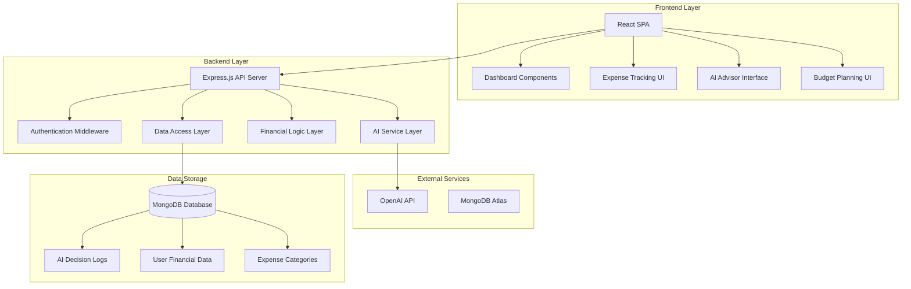

# Design Document: CoinTent

## Overview

CoinTent is a web-based financial planning platform specifically designed for content creators. The system employs a modern MERN stack architecture (MongoDB, Express.js, React, Node.js) with integrated AI capabilities through OpenAI's API. The platform focuses on providing transparent, explainable AI-powered financial guidance while maintaining a calm, mindful user experience that promotes healthy financial decision-making.

The core philosophy centers on simplicity and transparency - making complex financial planning accessible to non-technical content creators while ensuring all AI recommendations are explainable and logged for user trust and learning.

## Architecture

### System Architecture



### Technology Stack

**Frontend:**
- React 18+ with functional components and hooks
- React Router for navigation
- Axios for HTTP client communication
- Chart.js or Recharts for data visualization
- Tailwind CSS for styling with calm, mindful design patterns

**Backend:**
- Node.js runtime environment
- Express.js web framework
- JWT-based authentication with refresh tokens
- Mongoose ODM for MongoDB interaction
- Rate limiting middleware for API protection

**Database:**
- MongoDB for flexible document storage
- Collections: users, expenses, budgets, ai_decisions, categories

**External Services:**
- OpenAI API (GPT-4) for AI-powered features
- Exponential backoff retry logic for API resilience

## Components and Interfaces

### Frontend Components

**Dashboard Component**
- Displays budget vs expense overview with visual charts
- Shows content-to-cost ratio insights
- Provides quick access to all major features
- Implements responsive design for mobile and desktop

**Budget Estimator Component**
- Form interface for content plan input
- Real-time budget calculation display
- AI reasoning explanation panel
- Historical data integration when available

**Expense Tracker Component**
- Quick expense entry form with auto-categorization
- Expense history with filtering and search
- Category breakdown visualizations
- Bulk import capabilities for existing data

**AI Advisor Component**
- "Is this worth it?" query interface
- Recommendation display with detailed reasoning
- Decision history and outcome tracking
- Feedback mechanism for AI improvement

**Transparency Dashboard**
- AI decision log viewer with chronological history
- Explanation interface for AI reasoning
- User feedback integration for continuous learning
- Plain language explanations of technical decisions

### Backend API Endpoints

**Authentication Endpoints**
```
POST /api/auth/register - User registration
POST /api/auth/login - User authentication
POST /api/auth/refresh - Token refresh
POST /api/auth/logout - User logout
```

**Budget Management Endpoints**
```
GET /api/budgets - Retrieve user budgets
POST /api/budgets/estimate - AI budget estimation
PUT /api/budgets/:id - Update budget
DELETE /api/budgets/:id - Delete budget
```

**Expense Tracking Endpoints**
```
GET /api/expenses - Retrieve expenses with filtering
POST /api/expenses - Create new expense
PUT /api/expenses/:id - Update expense
DELETE /api/expenses/:id - Delete expense
GET /api/expenses/categories - Get expense categories
```

**AI Advisory Endpoints**
```
POST /api/ai/spending-advice - Get spending recommendation
GET /api/ai/decisions - Retrieve AI decision history
POST /api/ai/feedback - Submit feedback on AI decision
```

**Dashboard Endpoints**
```
GET /api/dashboard/overview - Financial overview data
GET /api/dashboard/insights - Content-to-cost insights
GET /api/dashboard/trends - Spending trend analysis
```

### AI Service Integration

**OpenAI Integration Layer**
- Structured prompt engineering for consistent responses
- Response validation and sanitization
- Rate limit management with exponential backoff
- Fallback responses for API unavailability
- Cost optimization through prompt efficiency

**AI Decision Logging**
- Comprehensive logging of all AI interactions
- Reasoning capture and storage
- User feedback correlation
- Performance metrics tracking

## Data Models

### User Model
```javascript
{
  _id: ObjectId,
  email: String (unique, required),
  passwordHash: String (required),
  profile: {
    name: String,
    contentType: String, // "youtube", "instagram", "multi-platform"
    createdAt: Date,
    preferences: {
      currency: String,
      budgetPeriod: String, // "monthly", "weekly"
      notifications: Boolean
    }
  },
  refreshTokens: [String],
  createdAt: Date,
  updatedAt: Date
}
```

### Expense Model
```javascript
{
  _id: ObjectId,
  userId: ObjectId (ref: User),
  amount: Number (required),
  description: String (required),
  category: String (required),
  subcategory: String,
  date: Date (required),
  contentRelated: Boolean,
  contentPiece: String, // Optional reference to specific content
  receiptUrl: String, // Optional receipt storage
  aiSuggested: Boolean, // Whether category was AI-suggested
  createdAt: Date,
  updatedAt: Date
}
```

### Budget Model
```javascript
{
  _id: ObjectId,
  userId: ObjectId (ref: User),
  period: String, // "monthly", "per-content"
  amount: Number (required),
  category: String,
  contentPlan: {
    description: String,
    estimatedPieces: Number,
    contentType: String
  },
  aiGenerated: Boolean,
  aiReasoning: String,
  status: String, // "active", "draft", "archived"
  createdAt: Date,
  updatedAt: Date
}
```

### AI Decision Model
```javascript
{
  _id: ObjectId,
  userId: ObjectId (ref: User),
  decisionType: String, // "budget-estimate", "spending-advice", "categorization"
  input: Object, // Original user input
  output: Object, // AI response
  reasoning: String, // AI explanation
  confidence: Number, // AI confidence score
  userFeedback: {
    helpful: Boolean,
    followed: Boolean,
    comments: String
  },
  outcome: String, // Actual result if available
  createdAt: Date
}
```

### Category Model
```javascript
{
  _id: ObjectId,
  name: String (required),
  description: String,
  parentCategory: String,
  contentCreatorRelevant: Boolean,
  suggestedKeywords: [String],
  defaultBudgetPercentage: Number,
  createdAt: Date
}
```

## Correctness Properties

*A property is a characteristic or behavior that should hold true across all valid executions of a system—essentially, a formal statement about what the system should do. Properties serve as the bridge between human-readable specifications and machine-verifiable correctness guarantees.*

### Property 1: Budget Estimation Consistency
*For any* valid content plan (monthly or per-content), the Budget_Estimator should generate estimates with reasoning, and when historical data exists, the estimates should differ from estimates without historical data.
**Validates: Requirements 1.1, 1.2, 1.3, 1.4**

### Property 2: Real-time Budget Updates
*For any* content plan modification, the system should immediately update budget estimates to reflect the changes.
**Validates: Requirements 1.5**

### Property 3: Expense Recording Completeness
*For any* expense entry, the system should store it with timestamp, amount, and automatically suggest appropriate categories.
**Validates: Requirements 2.1, 2.2**

### Property 4: Expense Display and Filtering
*For any* set of expenses, the system should group them by category with visual breakdowns and provide filtering by date, category, and amount ranges.
**Validates: Requirements 2.3, 2.4**

### Property 5: Category Suggestion Consistency
*For any* two expenses with similar descriptions, the system should suggest similar or identical categories.
**Validates: Requirements 2.5**

### Property 6: AI Spending Advice Completeness
*For any* spending advice request, the Spending_Advisor should provide a recommendation with explainable reasoning that considers budget status, financial goals, and potential ROI.
**Validates: Requirements 3.1, 3.2, 3.3**

### Property 7: AI Decision Logging and Feedback
*For any* AI recommendation, the system should log the decision with reasoning, and when feedback is provided, it should be stored and influence future recommendations.
**Validates: Requirements 3.4, 3.5, 5.1**

### Property 8: Dashboard Data Accuracy
*For any* user with budget and expense data, the dashboard should accurately display budget vs expenses, content-to-cost ratios, visual charts, and update when budget periods change.
**Validates: Requirements 4.1, 4.2, 4.3, 4.4**

### Property 9: Goal Progress Tracking
*For any* user with set financial goals, the dashboard should calculate and display accurate progress indicators.
**Validates: Requirements 4.5**

### Property 10: AI Transparency and History
*For any* AI decision, users should be able to request explanations showing influencing factors and view chronological decision history with outcomes.
**Validates: Requirements 5.2, 5.3**

### Property 11: AI Learning Transparency
*For any* user feedback on AI decisions, the system should update its decision-making and document these changes transparently.
**Validates: Requirements 5.5**

### Property 12: Information Presentation Limits
*For any* data display, the system should present information in digestible chunks with appropriate pagination or limiting.
**Validates: Requirements 6.4**

### Property 13: Data Persistence and Retrieval
*For any* user account creation or financial data entry, the system should securely store the data immediately and retrieve complete financial history upon login.
**Validates: Requirements 7.1, 7.2, 7.3**

### Property 14: Data Integrity Validation
*For any* data storage attempt, the system should validate data integrity and reject corrupted or invalid data.
**Validates: Requirements 7.4**

### Property 15: Performance Standards
*For any* data access request, the system should load data within acceptable performance thresholds (under 2 seconds for standard queries).
**Validates: Requirements 7.5**

### Property 16: AI API Integration Reliability
*For any* AI feature request, the system should communicate with OpenAI API reliably and validate/sanitize responses before display.
**Validates: Requirements 8.1, 8.3**

### Property 17: Error Handling and Graceful Degradation
*For any* API failure or AI service unavailability, the system should handle errors gracefully, provide fallback responses, and maintain core financial tracking functionality.
**Validates: Requirements 8.2, 8.5**

### Property 18: Rate Limit Management
*For any* sequence of API requests, the system should manage rate limits to prevent service interruption through exponential backoff and request queuing.
**Validates: Requirements 8.4**

## Error Handling

### API Error Handling
The system implements comprehensive error handling for OpenAI API integration:

- **Rate Limiting**: Exponential backoff with jitter for rate limit errors
- **Network Failures**: Retry logic with circuit breaker pattern
- **Invalid Responses**: Response validation and sanitization
- **Fallback Mechanisms**: Graceful degradation to core functionality when AI unavailable

### Database Error Handling
MongoDB operations include robust error handling:

- **Connection Failures**: Automatic reconnection with exponential backoff
- **Validation Errors**: Comprehensive data validation before persistence
- **Constraint Violations**: Proper error messages for duplicate keys and invalid references
- **Transaction Failures**: Rollback mechanisms for multi-document operations

### Frontend Error Handling
React components implement error boundaries and user-friendly error states:

- **Network Errors**: Retry mechanisms with user feedback
- **Validation Errors**: Real-time form validation with clear messaging
- **Loading States**: Proper loading indicators and skeleton screens
- **Fallback UI**: Graceful degradation when components fail

### Security Error Handling
Authentication and authorization errors are handled securely:

- **Invalid Tokens**: Automatic token refresh with fallback to login
- **Unauthorized Access**: Proper HTTP status codes and secure redirects
- **Input Validation**: Sanitization and validation of all user inputs
- **Rate Limiting**: Protection against brute force and abuse

## Testing Strategy

### Dual Testing Approach
The testing strategy employs both unit testing and property-based testing as complementary approaches:

**Unit Tests** focus on:
- Specific examples and edge cases
- Integration points between components
- Error conditions and boundary cases
- Authentication and authorization flows

**Property Tests** focus on:
- Universal properties that hold for all inputs
- Comprehensive input coverage through randomization
- Business logic correctness across diverse scenarios
- AI integration reliability and consistency

### Property-Based Testing Configuration
- **Testing Library**: fast-check for JavaScript/TypeScript property-based testing
- **Test Iterations**: Minimum 100 iterations per property test for statistical confidence
- **Test Tagging**: Each property test tagged with format: **Feature: cointent, Property {number}: {property_text}**
- **Coverage Requirements**: Each correctness property implemented by exactly one property-based test

### Unit Testing Strategy
- **Frontend**: Jest + React Testing Library for component testing
- **Backend**: Jest + Supertest for API endpoint testing
- **Database**: MongoDB Memory Server for isolated database testing
- **Integration**: End-to-end testing with Cypress for critical user flows

### Test Data Management
- **Property Tests**: Randomized test data generation for comprehensive coverage
- **Unit Tests**: Carefully crafted test fixtures for specific scenarios
- **Integration Tests**: Realistic test data that mirrors production scenarios
- **Performance Tests**: Large datasets to validate performance requirements

### Continuous Integration
- **Automated Testing**: All tests run on every commit and pull request
- **Coverage Requirements**: Minimum 80% code coverage for critical paths
- **Performance Monitoring**: Automated performance regression detection
- **Security Testing**: Automated security vulnerability scanning